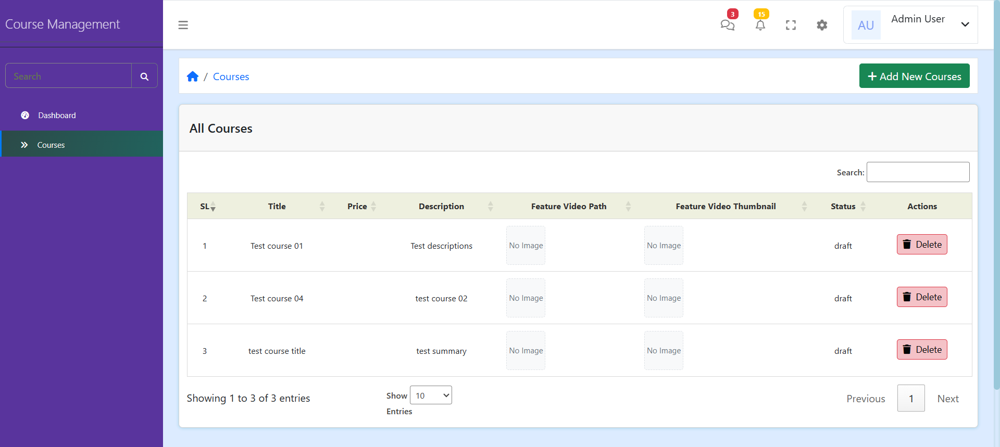
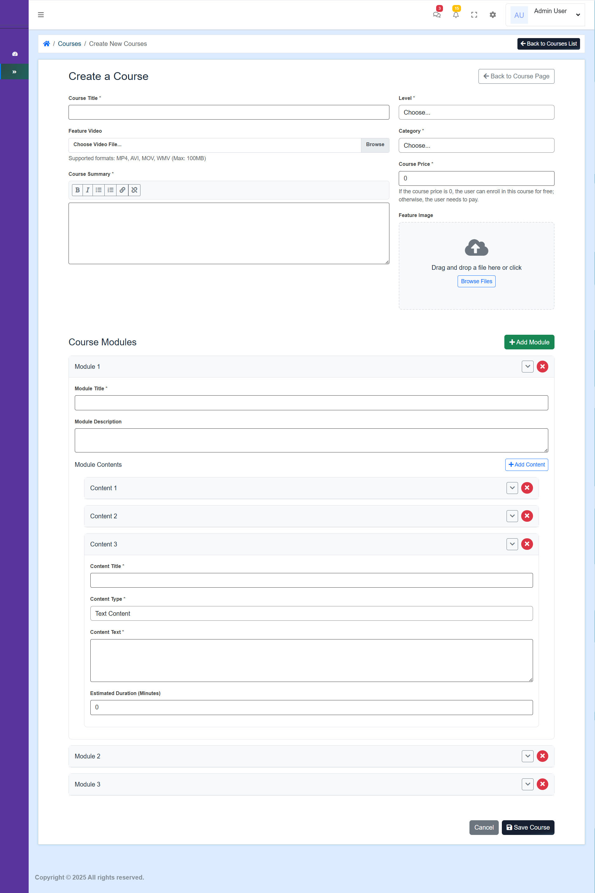

# Laravel 12 Course Creation Project Setup

## Prerequisites

- PHP 8.2 or higher
- Composer 2.x
- Node.js 18+ and npm
- MySQL 8.0+
- XAMPP (for local development)

## Installation Steps

1. **Clone the Repository**
   ```bash
   git clone https://github.com/sharifWebDev/cource-creation.git
   cd course-creation
   ```

2. **Install PHP Dependencies**
   ```bash
   composer install
   ```

3. **Environment Setup**
   ```bash
   # Copy environment file
   cp .env.example .env
   
   # Generate application key
   php artisan key:generate
   ```

4. **Configure Database**
   
   Edit `.env` file and update these lines:
   ```env
   DB_CONNECTION=mysql
   DB_HOST=127.0.0.1
   DB_PORT=3306
   DB_DATABASE=course_creation
   DB_USERNAME=root
   DB_PASSWORD=
   ```

5. **Run Migrations and auto seed**
   ```bash
   php artisan migrate
   ```

6. **Install Node Dependencies**
   ```bash
   npm install
   ```

7. **Build Assets**
   ```bash
   npm run dev
   ```

8. **Create Storage Link**
   ```bash
   php artisan storage:link
   ```

9. **Start Development Server**
   ```bash
   php artisan serve
   ```
## Project Modules & Access


### Admin Login Credentials
```
Email: admin@example.com
Password: admin123
```

### Admin Dashboard
Access the course management interface at:
```
http://127.0.0.1:8000/admin/courses
```

### Available Modules
- Course Management
  - Create new courses
  http://127.0.0.1:8000/admin/courses/create
  - Course List
  http://127.0.0.1:8000/admin/courses


**Demo image:** 
Course LIST


Course Creation:

